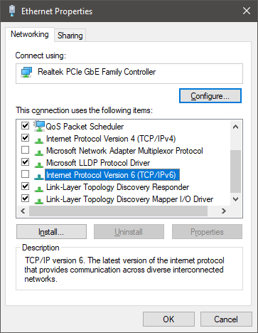

# ytp+ suite Installer
Uses [NSIS](https://nsis.sourceforge.io/Download).

## The installer keeps closing on me!
Try disabling IPv6 and install again.

## How do I open ytp+ studio?
Check in the start menu under ``ytp+ suite``.

## Where is the source code for ytp+ studio?
This is where the installation directory is set. Usually ``%appdata%\YTPPlusSuite\YTPPlusStudioSource``.

## How do I uninstall this?
Delete the installation directory, usually ``%appdata%\YTPPlusSuite``.

Anything installed via Chocolatey must be removed separately.

## I need more help!

Contact us on our [Discord](https://discord.gg/8ppmspR6Wh).

[Download here](https://github.com/YTP-Plus/YTPPlusSuiteInstaller/releases/)
